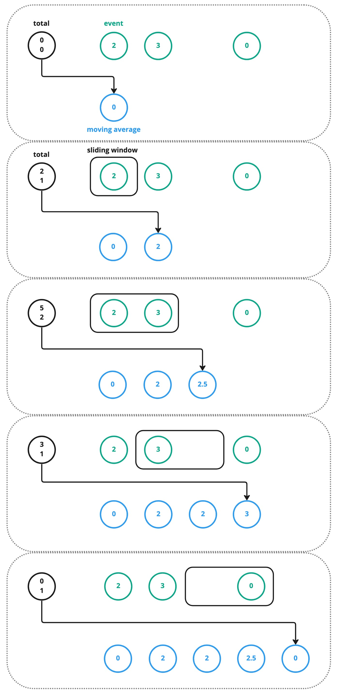

# Moving Average CLI

Simple command line application that parses a stream of events and produces an aggregated output. 

For every minute, the application produces a moving average of the translation delivery time for the last X minutes.

## Context

At Unbabel we deal with a lot of translation data. One of the metrics we use for our clients' SLAs is the delivery time 
of a translation. 

In the context of this problem, our translation flow is modeled as only one event.

### *translation_delivered*

Example:

```json
{
	"timestamp": "2018-12-26 18:12:19.903159",
	"translation_id": "5aa5b2f39f7254a75aa4",
	"source_language": "en",
	"target_language": "fr",
	"client_name": "airliberty",
	"event_name": "translation_delivered",
	"duration": 20,
	"nr_words": 100
}
```

## Quick Start

To calculate, for each minute, the moving average delivery time of all translations for the past 10 minutes you should 
call the application like this:

	./aggregator-cli moving-average --input_file example/events.json --window_size 10
	
The input file must have the following format:

```
{"timestamp": "2018-12-26 18:11:08.509654","translation_id": "5aa5b2f39f7254a75aa5","source_language": "en","target_language": "fr","client_name": "airliberty","event_name": "translation_delivered","nr_words": 30, "duration": 20}
{"timestamp": "2018-12-26 18:15:19.903159","translation_id": "5aa5b2f39f7254a75aa4","source_language": "en","target_language": "fr","client_name": "airliberty","event_name": "translation_delivered","nr_words": 30, "duration": 31}
{"timestamp": "2018-12-26 18:23:19.903159","translation_id": "5aa5b2f39f7254a75bb3","source_language": "en","target_language": "fr","client_name": "taxi-eats","event_name": "translation_delivered","nr_words": 100, "duration": 54}
```

The lines in the input must be ordered by the `timestamp` key, from lower (oldest) to higher values, just like in the 
example input above.

The output file will have the following format.

```
{"date": "2018-12-26 18:11:00", "average_delivery_time": 0}
{"date": "2018-12-26 18:12:00", "average_delivery_time": 20}
{"date": "2018-12-26 18:13:00", "average_delivery_time": 20}
{"date": "2018-12-26 18:14:00", "average_delivery_time": 20}
{"date": "2018-12-26 18:15:00", "average_delivery_time": 20}
{"date": "2018-12-26 18:16:00", "average_delivery_time": 25.5}
{"date": "2018-12-26 18:17:00", "average_delivery_time": 25.5}
{"date": "2018-12-26 18:18:00", "average_delivery_time": 25.5}
{"date": "2018-12-26 18:19:00", "average_delivery_time": 25.5}
{"date": "2018-12-26 18:20:00", "average_delivery_time": 25.5}
{"date": "2018-12-26 18:21:00", "average_delivery_time": 25.5}
{"date": "2018-12-26 18:22:00", "average_delivery_time": 31}
{"date": "2018-12-26 18:23:00", "average_delivery_time": 31}
{"date": "2018-12-26 18:24:00", "average_delivery_time": 42.5}
```

## Flags

Below are the flags provided by the tool:

| Flag        | Usage                                                   | Mandatory |
|-------------|---------------------------------------------------------|-----------|
| input_file  | File name where the input events are stored             | `true`    |
| window_size | Window size to use in the moving average calculation    | `true`    |
| output_type | Where to write the output. Options: `file` and `stdout` | `false`   |


## Example

An example input file is provided in `example/input.json`.

## Project Structure

This project is *slightly* (wink) overengineered for this purpose. The motivation for this was not only to complete 
the code challenge but also to experiment with the hexagonal architecture pattern.

The hexagonal architecture is used isolate the business logic from the input and output. The project can be easily 
extended to read from queues instead of files (e.g., such as AWS SQS) and to emit events with the results instead of 
writing them to the stdout (e.g., using AWS SNS). It's also easy to create new aggregation methods.

```
┌── cmd                           // Commands to run the application
└── internal                      // Everything that is internal to the application
    ├── common                    // Common modules used in multiple places within application
    ├── core                      // Core (business logic)
        ├── application           // Business logic. Implements interactorprt and uses infrastructureprt
        ├── domain                // Business models
        ├── infrastructureprt     // Ports (interfaces) for infrastructure
        └── interactorprt         // Ports (interfaces) for interactors
    ├── infrastructure            // Primary/Driving adapters - entrypoint (e.g., files, queues, api, etc)
    └── interactors               // Secondary/Driven adapters (e.g., files, databases, etc). 
```

## FAQ

**Q1: Is so much code really needed?**  
A1: The answer to this question is a simple no. I wanted to take this opportunity to implement a new project
from scratch using a Hexagonal Architecture, and while it is definitely overengineered for this purpose, it also allows
me to experiment and showcase my architectural skills.

**Q2: How does the algorithm for calculating the moving averages work?**  
A2: The algorithm uses the sliding window technique and has a time complexity of O(N), where N is the time between the
first and last event. It has a running total/count, which it uses to calculate the average at each step. The head and
tail are used to add/remove from these running values. It has an additional space complexity of O(M) where M is the
window size (and O(N) for the result). You can find a diagram at the bottom of this page.

**Q3: How would you improve the algorithm?**  
A3: It could be turned into a continuously running algorithm that calculates the moving average as more inputs are 
provided. This would make it more dynamic and useful in the real world. The current algorithm expects all events at once. 

